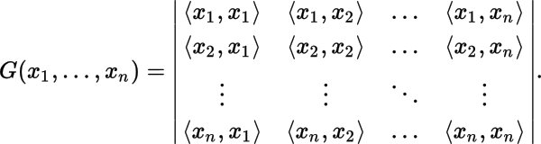

### Gram Matrix

Given a set of vectors $v_1, \dots, v_n$, matrix with entries $G_{ij} = <v_i, v_j>$ is called gram matrix. The entries are the inner products of the vectors.  

Gram matrix is always symmetric, meaning that $G_{ij} = G_{ji}$ for every pair $(i, j)$. It is also **positive semi-definite**, meaning that $u^TGu \ge 0$ for every vector $u \in R^n$.  

An important application is to compute linear independence: a set of vectors is linearly independent if and only if the Gram determinant (the determinant of the Gram matrix) is non-zero.  

