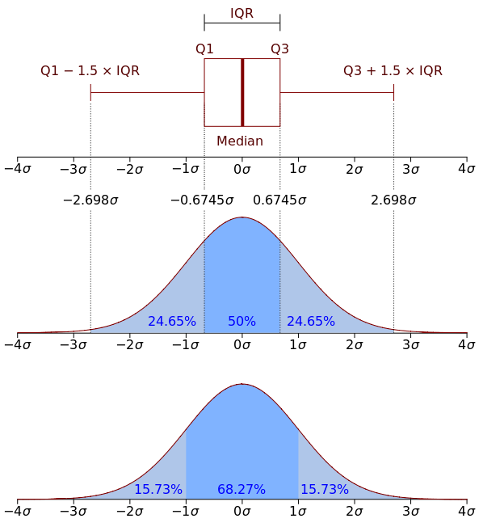

#### Five Number Summary

It's a set of descriptive statistics.

1. the sample minimum (smallest observation)
2. the lower quartile or first quartile : Q1
3. the median (middle value): Q2
4. the upper quartile or third quartile: Q3
5. the sample maximum (largest observation)


#### Details

The median is the value separating the higher half of a data sample from the lower half. `{1, 3, 3, 6, 7, 8, 9} --> 6`，中位数相对于平均数而言，not skewed so much by extremely large or small values and may give a better idea of a typical value.  

- Q1: splits off the lowest 25% of data from the highest 75%
- Q2: cuts data set in half
- Q3: splits off the highest 25% of data from the lowest 75%
- IQR = Q3-Q1: Interquartile range, a robust statistic compared to the range and standard deviation
- Lower fence = Q1 - 1.5(IQR)
- Upper fence = Q3 - 1.5(IQR)
- Outside fences, consider it as outliers



#### Demo

```r
moons <- c(0, 0, 1, 2, 63, 61, 27, 13)
fivenum(moons)
# [1]  0.0  0.5  7.5 44.0 63.0
summary(moons)
# Min. 1st Qu.  Median   Mean    3rd Qu.    Max. 
# 0.0     0.5     7.5    20.88     44.0      63 
```

#### Reference

[Five Number Summary](https://en.wikipedia.org/wiki/Five-number_summary)