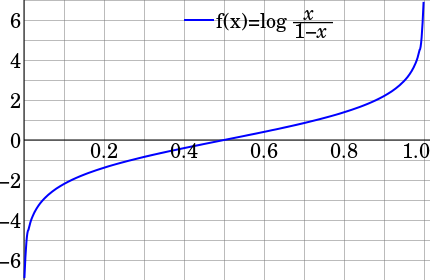

### Logit

The logic function is the inverse of the [sigmoidal logistic function](https://en.wikipedia.org/wiki/Sigmoid_function). When the function's parameter represents a probability p, the logic function gives the **log-odds**, or the logarithm of the odds $p \over (1-p)$.  

$$logit(p) = log(\frac{p}{1-p})$$  

and 

$$logit^{-1}(\alpha) = logistic(\alpha) = \frac{1}{1 + exp(-\alpha)}$$

