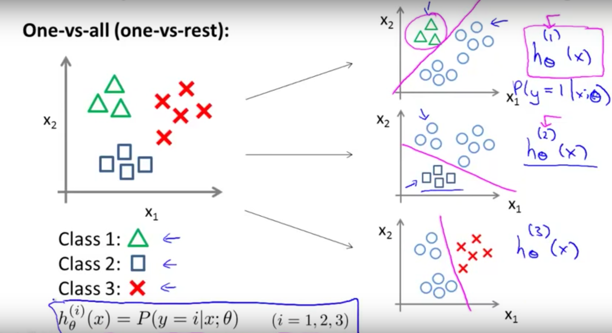
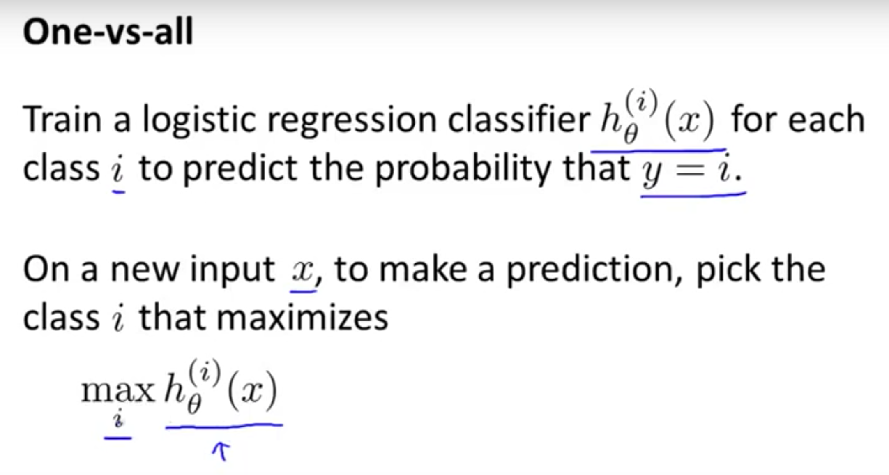

#### One-vs-All

One-vs-All又叫做One-vs-Rest，用来处理multiclass问题。有的算法本身支持多分类问题，但有的只能二分类，这时候one-vs-all可以将二分类转化为多分类。  

基本想法是，对每一class(共k个)，train一个classifier，可以将一个sample划分为class-1或其他(produce a real-values confidence score for its decision)，总共k个classifier。对新的sample，apply all classifiers to an unseen sample x and predicting the label k for which the corresponding classifier reports the highest confidence score。apply k 个classifiers之后，这k这class都对应一个概率，取最高的那个就好。    

$$\hat{y} = argmax_{k\in\{1\dots K\}} f_k(x)$$  

  

---

#### Reference

- [Multiclass classification](https://en.wikipedia.org/wiki/Multiclass_classification)
- [Machine Learning Multiclass Classification, One vs all](https://www.youtube.com/watch?v=6B1okbgfw8E)