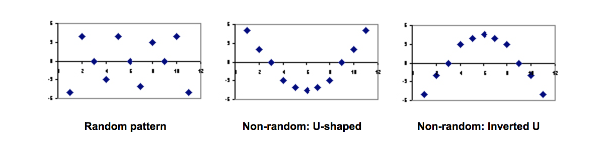
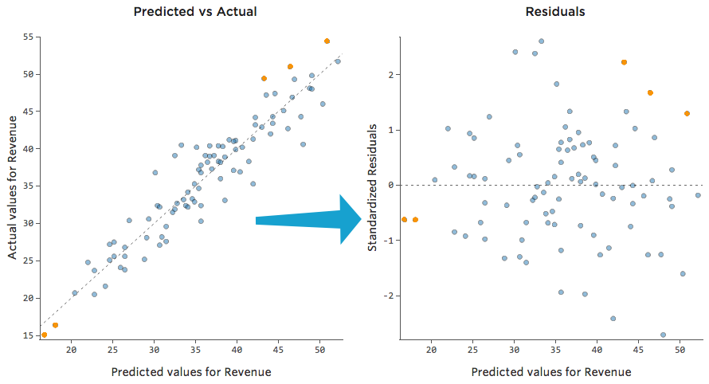

### Residual Plot

$Residual(e)= Observed(y) – Predicted(\hat{y})$

可以用来检查回归模型，Plot residual on the y-axis against predicted values。  

A residual plot is a graph that shows the residuals on the vertical axis and the independent variable on the horizontal axis. If the points in a residual plot are randomly dispersed around the horizontal axis, a linear regression model is appropriate for the data; otherwise, a non-linear model is more appropriate.  

Below, the residual plots show three typical patterns. The first plot shows a random pattern, indicating a good fit for a linear model. The other plot patterns are non-random (U-shaped and inverted U), suggesting a better fit for a non-linear model.  



### Demo

```python
plt.scatter(y_train_pred,  y_train_pred - y_train, c='blue', marker='o', label='Training data')
plt.scatter(y_test_pred,  y_test_pred - y_test, c='lightgreen', marker='s', label='Test data')
plt.xlabel('Predicted values')
plt.ylabel('Residuals')
plt.legend(loc='upper left')
plt.hlines(y=0, xmin=-10, xmax=50, lw=2, color='red')
plt.xlim([-10, 50])
```


### Reference

- [Residual Analysis in Regression](http://stattrek.com/regression/residual-analysis.aspx?tutorial=ap)
- [Interpreting residual plots to improve your regression](http://docs.statwing.com/interpreting-residual-plots-to-improve-your-regression/)


