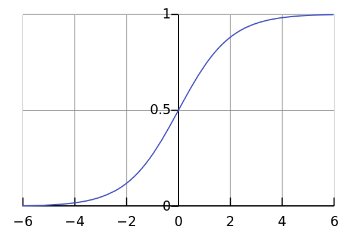

### Sigmoid

Sigmoid function is a S shaped curve. It ranges from zero to one.

$$ S(t) = \frac{1}{1 + exp^{(-t)}} $$ 

and it's derivative can be expressed by the function itself.

$$ S^\prime(t) = S(t)(1 - S(t)) $$

