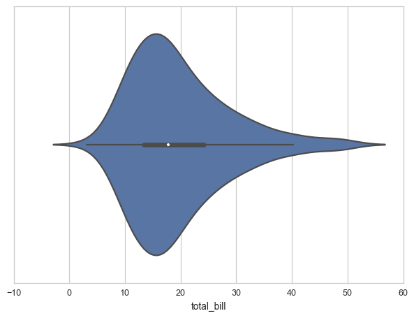

### Violin Plot

和boxplot类似，但with  a rotated kernel density plot on each side. 除了标出median以及interquartile range之外，Violin plot还给出了probability density of data at different values。  

- 和boxplot一样，violin plot也可用来对比不同categories的变量的分布，比如不同制造商汽车价格。
- 当data distribution是multimodal(more than one peak)时，violin plot更informative


### Demo

```python
# http://seaborn.pydata.org/generated/seaborn.violinplot.html
import seaborn as sns
sns.set_style("whitegrid")
tips = sns.load_dataset("tips")
ax = sns.violinplot(x=tips["total_bill"])
```

