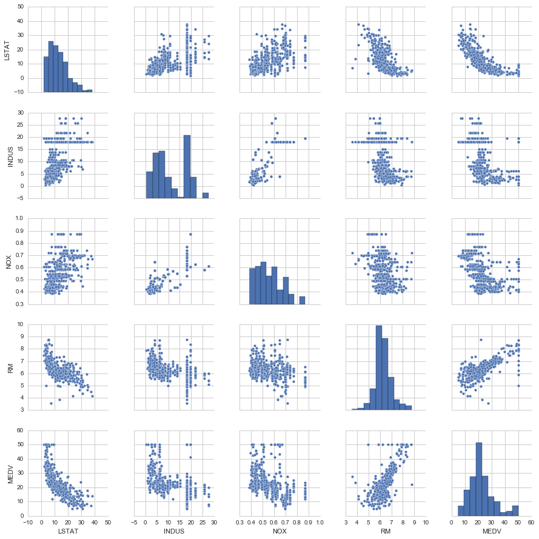

### EDA

探索性数据分析 (Exploratory Data Analysis)，理解变量的分布与变量之间的关系。

- Suggest hypotheses about the causes of observed phenomena
- Assess assumptions on which statistical inference will be based
- Support the selection of appropriate statistical tools and techniques
- Provide a basis for further data collection through surveys or experiments

**常用技巧**：

- Box Plot
- Scatter Plot
- Histogram
- Multidimensional Scaling
- PCA
- Dimensionality Reduction
- ......


### Demo

A scatter matrix demo.

```python
%matplotlib inline

import matplotlib.pyplot as plt
import seaborn as sns
sns.set(style='whitegrid') 

cols = ['LSTAT', 'INDUS', 'NOX', 'RM', 'MEDV']
# scatterplot matrix, 对角线上是变量分布的直方图，非对角线上是两个变量的散点图
sns.pairplot(df[cols], size=2.5)
plt.tight_layout()
```



### Reference

[Wiki](https://en.wikipedia.org/wiki/Exploratory_data_analysis)
