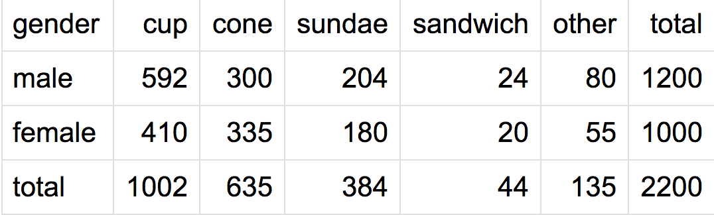

### Contingency Table

A contingency table (aka a cross tabulation or crosstab, or two-way frequency table) is a type of table in a matrix format that display the multivariate frequency distribution of the variables. It presents categorical data in terms of frequency counts.

